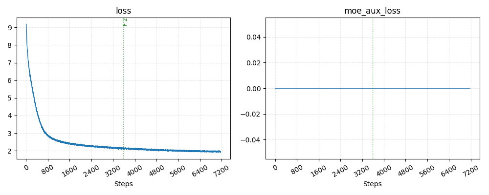
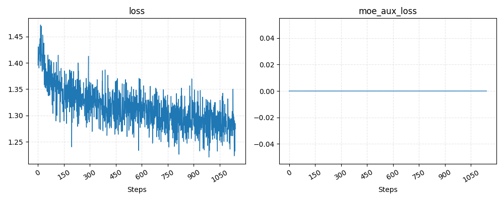
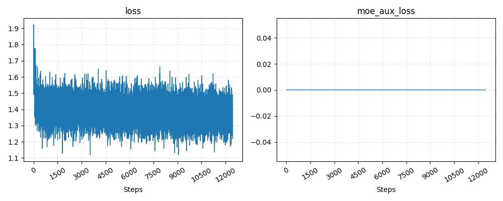
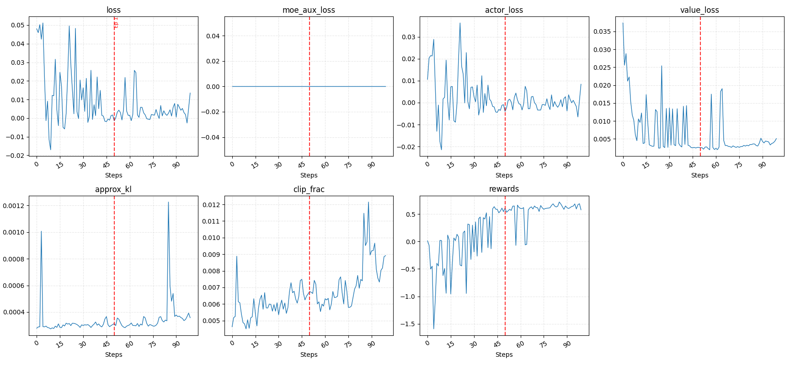

<div align="center">
    
</div>

<div align="center"><b>个人构建MoE大模型：从预训练到RLHF的完整实践</b></div> <br />

<div align="center">


[](https://github.com/qibin0506/Cortex/stargazers)
[](LICENSE)
[](https://github.com/qibin0506/Cortex/commits/master)
[](https://github.com/qibin0506/Cortex/pulls)
</div>

## ✨ 模型简介
1. Cortex是一个个人可承担训练成本、从头进行训练的的LLM，训练过程包括Pretrain、Midtrain、SFT和RLHF。
2. 完全解耦模型、训练代码，模型代码：[llm_model](https://github.com/qibin0506/llm_model)，训练代码：[llm_trainer](https://github.com/qibin0506/llm_trainer)
3. 在线体验：[modelscope](https://www.modelscope.cn/studios/qibin0506/Cortex)

## 🔥 更新日志
2026.1.29 Cortex 3.0发布。Cortex 2.5请访问：[cortex_2.5](https://github.com/qibin0506/Cortex/tree/cortex_2.5)
1. 模型：使用自训练的8192大小的tokenizer，模型类型为80M参数的dense模型。
2. 升级llm_model和llm_trainer，训练速度全面提升，完整训练流程耗时约7小时(硬件规则为4*4090)。
3. 不在支持思考模式、思考控制和深度搜索，如需训练思考模式请参考[cortex_2.5](https://github.com/qibin0506/Cortex/tree/cortex_2.5)。
4. 简化训练流程，训练过程包括Pretrain、Midtrain、SFT和PPO。
5. 优化断点续训，可快速恢复训练。

## 🚀 快速开始

### 本地安装
1. 本机已安装python>=3.10
2. clone或下载本项目，并切换到项目目录
3. 安装依赖 `pip3 install -r requirements.txt`
4. 执行 `python3 app.py`运行项目，首次允许会下载模型文件，等待服务准备完成后，访问链接 <a href="http://0.0.0.0:8080/)" target="_blank">http://0.0.0.0:8080/</a> 即可体验

### 在线体验
本项目已部署在[modelscope](https://www.modelscope.cn/studios/qibin0506/Cortex)


## ⚙️ 技术细节

### 数据处理
Cortex 3.0采用[minimind_dataset](https://www.modelscope.cn/datasets/gongjy/minimind_dataset/files)数据集进行训练，拆分sft数据集，一部分作为预训练数据集，少量作为sft数据集，具体数据处理逻辑可参考[process_data.py](https://github.com/qibin0506/Cortex/blob/master/process_data.py)。


### 训练流程

#### Pretrain
Pretrain主要用于基础知识学习，max_position_embeddings设置为512。
使用`smart_train train_pretrain.py`开启训练，训练日志在log目录下，可通过`vis_log ./log/log.txt`查看训练指标，`vis_lr ./log/lr.txt`查看lr。
训练完成后，需要将zero checkpoint转化为`last_checkpoint.bin`保存到训练根目录继续下一个阶段的训练。然后删除`ckpt_dir`和`log`目录。
```bash
cd ./ckpt_dir
python3 zero_to_fp32.py ./ ../
cd ..
mv pytorch_model.bin last_checkpoint.bin
```
Pretrain指标：
 

#### Midtrain
Midtrain采用YARN将max_position_embeddings扩展到2048，以支持长上下文。
使用`smart_train train_midtrain.py`开启训练，训练日志在log目录下，可通过`vis_log ./log/log.txt`查看训练指标，`vis_lr ./log/lr.txt`查看lr。
训练完成后，需要将zero checkpoint转化为`last_checkpoint.bin`保存到训练根目录继续下一个阶段的训练。然后删除`ckpt_dir`和`log`目录。
```bash
cd ./ckpt_dir
python3 zero_to_fp32.py ./ ../
cd ..
mv pytorch_model.bin last_checkpoint.bin
```
Midtrain指标：
 

#### SFT
SFT主要是让模型学会对话，学习固定的对话格式和根据用户prompt进行回答。
使用`smart_train train_sft.py`开启训练，训练日志在log目录下，可通过`vis_log ./log/log.txt`查看训练指标，`vis_lr ./log/lr.txt`查看lr。
训练完成后，需要将zero checkpoint转化为`last_checkpoint.bin`和`sft.bin`保存到训练根目录继续下一个阶段的训练。然后删除`ckpt_dir`和`log`目录。
```bash
cd ./ckpt_dir
python3 zero_to_fp32.py ./ ../
cd ..
mv pytorch_model.bin last_checkpoint.bin
cp last_checkpoint.bin sft.bin
```
SFT指标：
 

#### PPO
使用`smart_train train_ppo.py`开启训练，训练日志在log目录下，可通过`vis_log ./log/log.txt`查看训练指标。
预训练完成后，需要将zero checkpoint转化为`ppo.bin`。需要注意的是：`ppo.bin`中包含了policy模型和value模型，需要通过运行`extract_ppo_result.py`将policy模型从`ppo.bin`中提取出来使用，提取结果`ppo_policy.bin`可作为最终训练结果使用。
```bash
cd ./ckpt_dir
python3 zero_to_fp32.py ./ ../
cd ..
mv pytorch_model.bin ppo.bin
# 从ppo.bin提取ppo_policy.bin
python3 extract_ppo_result.py
```
PPO指标：
 


##### PPO和SFT对比
sft后模型已经可以正常对话了，在经过PPO后回答的内容会跟符合人类的口味，该功能通过reward model打分训练实现。为了证明PPO的效果，可以通过运行`python3 compare_ppo_sft.py`对比结果。以下是对比结果：
```
sft avg score = -0.73046875
ppo avg score = 0.8203125
```

## 📊 star-history
<picture>
  <source media="(prefers-color-scheme: dark)" srcset="https://api.star-history.com/svg?repos=qibin0506/Cortex&type=Date&theme=dark"/>
  <source media="(prefers-color-scheme: light)" srcset="https://api.star-history.com/svg?repos=qibin0506/Cortex&type=Date"/>
  
</picture>
