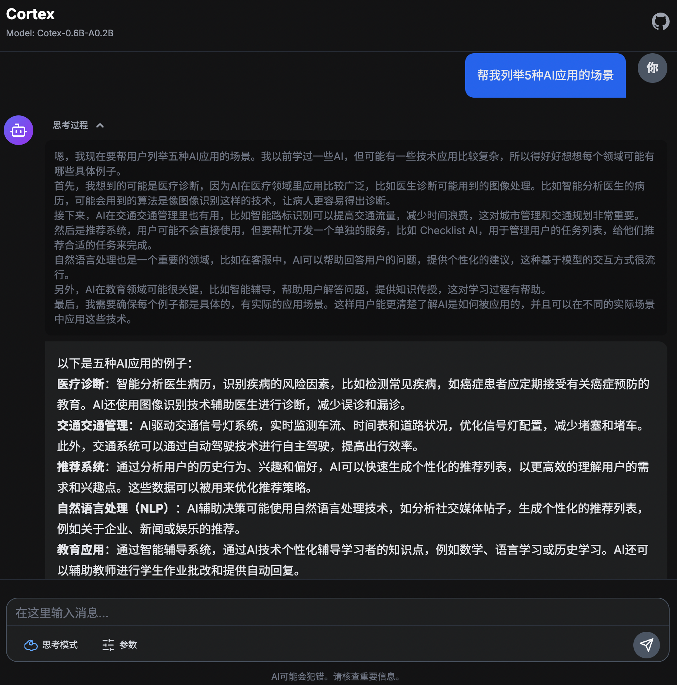
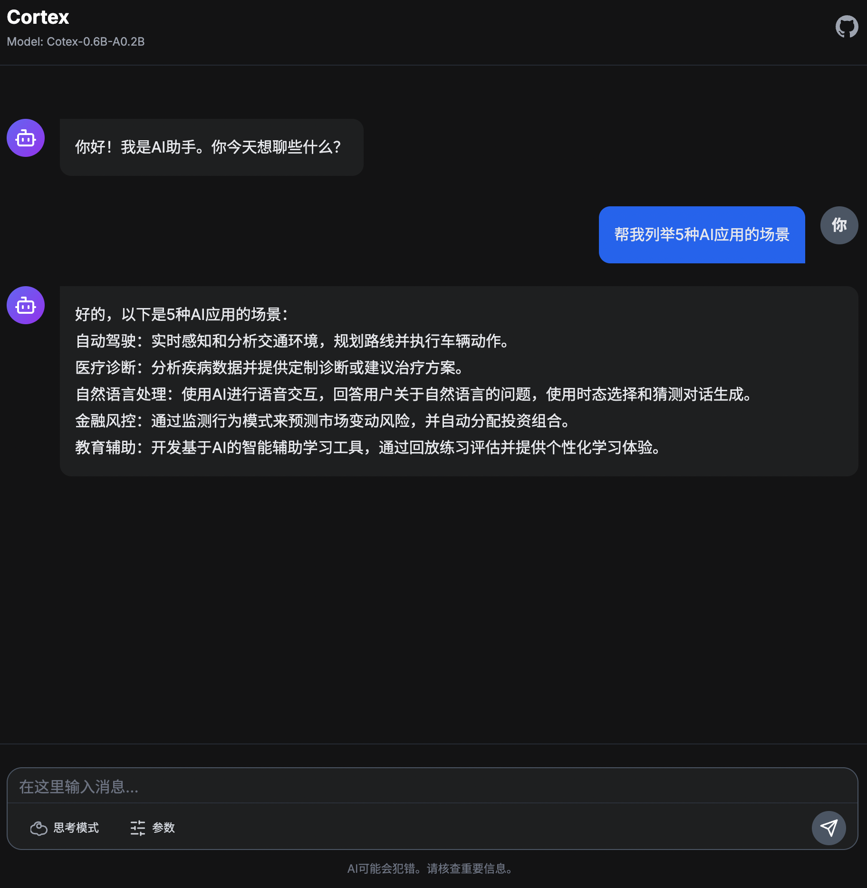
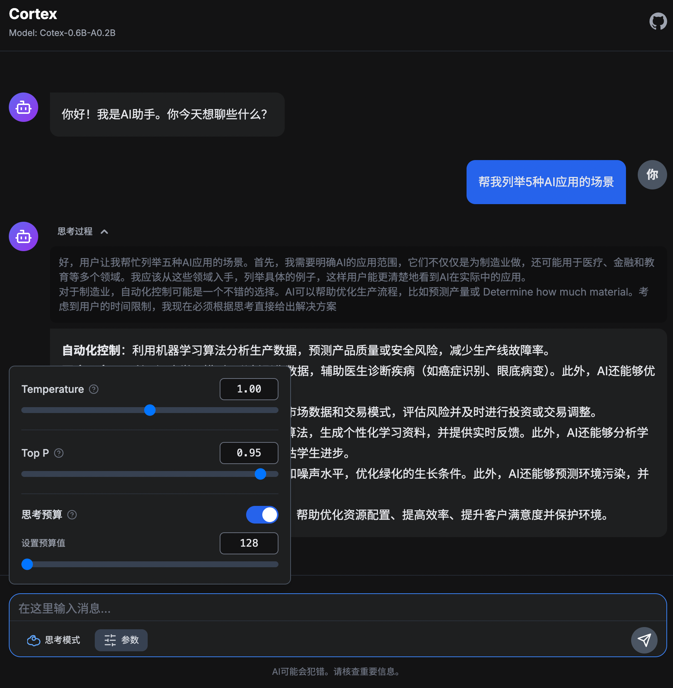

    

### 从零构建MoE大模型：从预训练到DPO的完整实践
---

2025.8.29 更新内容：
1. 优化器从Adam替换为Lion，训练更省显存；需升级llm_trainer到0.8.0版本。

2025.8.28 更新内容：
1. dpo训练修改为2个epoch，同时增加nll_loss，并重新训练dpo。

2025.8.23 更新内容：
1. 替换预训练数据集，使用[序列猴子通用文本数据集](https://github.com/mobvoi/seq-monkey-data/blob/main/docs/pretrain_open_corpus.md)进行预训练。
2. 使用更先进的训练方法。
3. 新增思考模式控制，可通过添加/think和/no think控制是否思考。
4. 新增思考预算功能，可控制思考token长度。
   
Cortex V1版本：[https://github.com/qibin0506/Cortex/tree/v1](https://github.com/qibin0506/Cortex/tree/v1)

| 思考模式 | 非思考模式 | 思考预算 |
|----------|----------|----------|
|  |  |  |

**模型尺寸：0.6B，MoE推理激活参数0.2B**

本项目提供训练各个阶段checkpoint，可按需下载。下载地址：[https://www.modelscope.cn/models/qibin0506/Cortex-V2](https://www.modelscope.cn/models/qibin0506/Cortex-V2)

### 快速开始
1. 确保本机已安装python3
2. clone或下载本项目
3. 安装依赖 `pip3 install -r requirements.txt`
4. 执行 `python3 app.py`运行项目，首次访问会下载模型文件，等待服务准备完成后，访问链接[http://0.0.0.0:8080/](http://0.0.0.0:8080/) 即可体验

### 技术细节
#### 模型和训练代码
本项目模型和训练代码完全开源并解耦。
1. 模型代码并作为通用LLM（支持VLM）项目开放在[https://github.com/qibin0506/llm-model](https://github.com/qibin0506/llm-model)
2. 训练代码支持Pretrain、SFT、GRPO、GSPO、DPO等训练方式，代码完成度较高，上手简单，项目开放在[https://github.com/qibin0506/llm_trainer](https://github.com/qibin0506/llm_trainer)

#### 训练细节
Cortex V2采用更加先进的训练方式进行训练，具体情况如下；

##### 预训练
预训练过程采用两阶段训练模式
| stage0 | stage1 |
|----------|----------|
| train_pretrain_stage0.py | train_pretrain_stage1.py |
| 上下文长度为512，在较短训练文本上进行训练 | 采用YaRN技术将上下文扩展至2048，并在长文本序列上继续训练 |

##### 后训练
后训练过程采用四阶段训练模式
| COT SFT | GSPO | MIX SFT | DPO |
|----------|----------|----------|----------|
| train_cot.py | train_grpo.py | train_mix.py | train_dpo.py |
| 在纯COT数据集上进行SFT，让模型原生支持思考模式 | 采用GSPO技术，提升模式的逻辑思考能力 | 使用COT和非COT混合数据集上进行SFT，让模式支持思考控制和思考预算能力 | 使用DPO进行对齐训练 |

#### 继续训练
本项目提供各个阶段训练完成后的checkpoint, 可根据自己需求选择checkpoint继续训练。
checkpoint下载：[https://www.modelscope.cn/models/qibin0506/Cortex-V2/files](https://www.modelscope.cn/models/qibin0506/Cortex-V2/files)
训练方式：
1. 确定继续训练的阶段，修改`file_dataset.py`中对应阶段的FileDataset中的文件，然后使用`smart_train`进行训练，例如重新进行dpo，则执行`smart_train train_dpo.py`
2. 本项目GSPO阶段是在4x5090进行训练，其他阶段都是在4x4090进行训练，同时`utils.py`中的配置数据也是按照对应硬件配置确定，如有不同的训练设备可自行修改`utils.py`进行适配。
3. `file_dataset.py`文件用来管理数据集文件，可按需修改，数据集文件会自动下载，使用完成后会自动删除，无需人工管理。

---
<picture>
  <source media="(prefers-color-scheme: dark)" srcset="https://api.star-history.com/svg?repos=qibin0506/Cortex&type=Date&theme=dark"/>
  <source media="(prefers-color-scheme: light)" srcset="https://api.star-history.com/svg?repos=qibin0506/Cortex&type=Date"/>
  
</picture>
