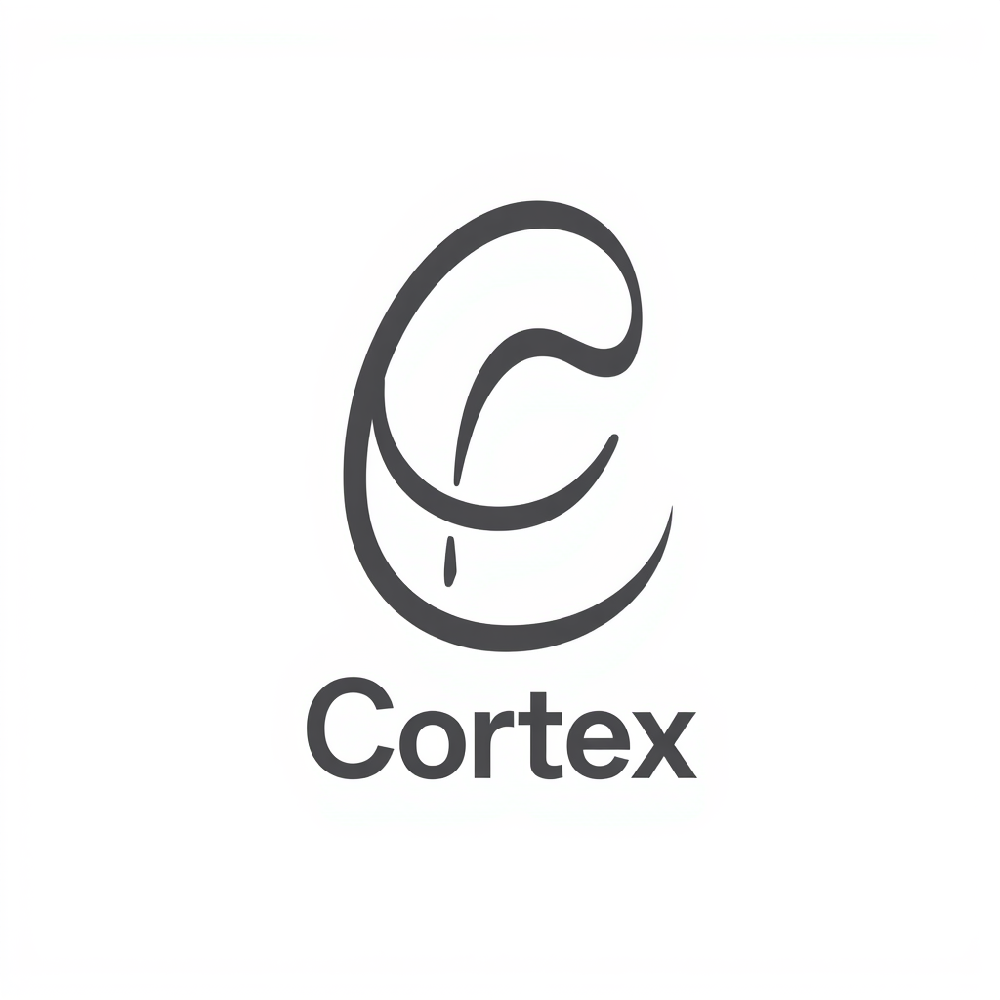

<div align="center">
    
</div>

<div align="center"><b>从零构建大模型：从预训练到RLHF的完整实践</b></div> <br />

<div align="center">


[](https://github.com/qibin0506/Cortex/stargazers)
[](LICENSE)
[](https://github.com/qibin0506/Cortex/commits/master)
[](https://github.com/qibin0506/Cortex/pulls)
</div>

## 📖 项目简介

**Cortex** 是一个致力于让个人开发者也能承担训练成本的 LLM 项目。本项目实现了从零开始构建大模型的全过程，代码完全开源且解耦。

### 🌟 Cortex 3.0 核心特性

*   **低成本高效能**：采用 **80M 参数 Dense 模型**，在 4x RTX 4090 环境下，**全流程训练仅需约 7 小时**。
*   **全链路覆盖**：包含 **Pretrain (预训练)** -> **Midtrain (长文适应)** -> **SFT (指令微调)** -> **PPO (强化学习)** 四大完整阶段。
*   **高度解耦**：

    *   🤖 模型定义：[qibin0506/llm\_model](https://github.com/qibin0506/llm_model)
    *   ⚙️ 训练框架：[qibin0506/llm\_trainer](https://github.com/qibin0506/llm_trainer)

> **⚠️ 版本说明**
>
> *   **Cortex 3.0 (当前)**：追求极致速度与标准流程，80M Dense 模型，支持 PPO。
> *   **[Cortex 2.5](https://github.com/qibin0506/Cortex/tree/cortex_2.5)**：支持 **MoE 架构**、**思考模式 (Thinking Mode)** 及深度搜索功能。如需研究类 o1 的思考能力，请切换至 2.5 分支。

## 📰 更新日志
<details open> 
<summary> <b>2026.3.17</b> </summary>
    
*   添加[Attention Residuals](https://github.com/MoonshotAI/Attention-Residuals)支持。
*   升级llm_model到0.9.0。
*   升级llm_trainer到0.14.4。

</details>
<details close> 
<summary> <b>2026.1.29</b> </summary>
    
*   🚀 **架构变更**：切换为 80M Dense 模型，使用自训练的 8192 词表 Tokenizer。
*   ⚡ **速度飞跃**：训练框架全面升级，断点续训优化，4x4090 仅需 7 小时跑通全流程。
*   📉 **流程精简**：移除思考模式，专注于标准 RLHF 流程（Pretrain -> Midtrain -> SFT -> PPO）。
 
</details>

## 🚀 快速开始

### ☁️ 在线体验

访问 ModelScope 创空间直接体验模型效果：

[👉 点击前往 ModelScope Studio](https://www.modelscope.cn/studios/qibin0506/Cortex)

### 💻 本地部署

1.  **环境准备**：确保 Python >= 3.10。
2.  **获取代码**：

    ```
    git clone https://github.com/qibin0506/Cortex.git
    cd Cortex

    ```
3.  **安装依赖**：

    ```
    pip3 install -r requirements.txt

    ```
4.  **启动服务**：

    ```
    python3 app.py

    ```

    *首次运行将自动下载模型文件，启动后访问 <http://0.0.0.0:8080/> 即可体验。*

## ⚙️ 训练流程详解

### 1. 数据准备

Cortex 3.0 采用 [Minimind Dataset](https://www.modelscope.cn/datasets/gongjy/minimind_dataset/files)。

*   脚本：`process_data.py`
*   逻辑：自动拆分 SFT 数据集，大部分用于预训练，少部分保留用于 SFT 阶段。

### 2. 阶段性训练指南

训练过程分为四个主要阶段，请按顺序执行。

| **阶段**           | **脚本**              | **上下文** | **目标与说明**   |
| :--------------- | :------------------ | :------ | :---------- |
| **I. Pretrain**  | `train_pretrain.py` | 512     | **基础知识学习**。 |
| **II. Midtrain** | `train_midtrain.py` | 2048    | **长文本适应**。  |
| **III. SFT**     | `train_sft.py`      | 2048    | **对话能力赋予**。 |
| **IV. PPO**      | `train_ppo.py`      | 2048    | **人类偏好对齐**。 |

#### 🔧 通用操作：监控与 Checkpoint 转换

*   **监控**：日志位于 `./log` 目录。

    *   查看指标：`vis_log ./log/log.txt`
    *   查看学习率：`vis_lr ./log/lr.txt`
*   **Checkpoint 转换**：每个阶段结束后，DeepSpeed 的 Checkpoint 需要转换为标准 bin 文件以便下一阶段加载。

***

#### 📌 阶段一：Pretrain (预训练)

```
# 1. 开始训练
smart_train train_pretrain.py

# 2. 转换权重 (训练完成后执行)
cd ./ckpt_dir
python3 zero_to_fp32.py ./ ../
cd ..
mv pytorch_model.bin last_checkpoint.bin

# 3. 清理 (可选)
rm -rf ./ckpt_dir ./log

```

> 📊 **Pretrain 指标预览**
>
> 

#### 📌 阶段二：Midtrain (长文适应)

```
# 1. 开始训练 (自动加载 last_checkpoint.bin)
smart_train train_midtrain.py

# 2. 转换权重
cd ./ckpt_dir
python3 zero_to_fp32.py ./ ../
cd ..
mv pytorch_model.bin last_checkpoint.bin

```

> 📊 **Midtrain 指标预览**
>
> 

#### 📌 阶段三：SFT (监督微调)

```
# 1. 开始训练
smart_train train_sft.py

# 2. 转换权重并归档
cd ./ckpt_dir
python3 zero_to_fp32.py ./ ../
cd ..
mv pytorch_model.bin last_checkpoint.bin
cp last_checkpoint.bin sft.bin  # 备份一份作为 SFT 结果

```

> 📊 **SFT 指标预览**
>
> 

#### 📌 阶段四：PPO (强化学习)

本阶段包含 Policy Model 和 Value Model 的联合训练。

```
# 1. 开始训练
smart_train train_ppo.py

# 2. 转换权重
cd ./ckpt_dir
python3 zero_to_fp32.py ./ ../
cd ..
mv pytorch_model.bin ppo.bin

# 3. 提取最终策略模型 (Policy)
# ppo.bin 包含 policy 和 value，需提取供推理使用
python3 extract_ppo_result.py
# 输出: ppo_policy.bin

```

> 📊 **PPO 指标预览**
>
> 

### 🆚 PPO vs SFT 效果对比

PPO 阶段通过 Reward Model 对模型生成进行打分和优化，显著提升了回复质量。运行 `python3 compare_ppo_sft.py` 可查看评分对比：

| **模型阶段** | **平均得分 (Avg Score)** | **说明**           |
| :------- | :------------------- | :--------------- |
| **SFT**  | `-0.73`              | 初步具备对话能力，但回复质量一般 |
| **PPO**  | `+0.82`              | **显著提升**，更符合人类偏好 |

---

## 📊 star-history
<picture>
  <source media="(prefers-color-scheme: dark)" srcset="https://api.star-history.com/svg?repos=qibin0506/Cortex&type=Date&theme=dark"/>
  <source media="(prefers-color-scheme: light)" srcset="https://api.star-history.com/svg?repos=qibin0506/Cortex&type=Date"/>
  
</picture>
