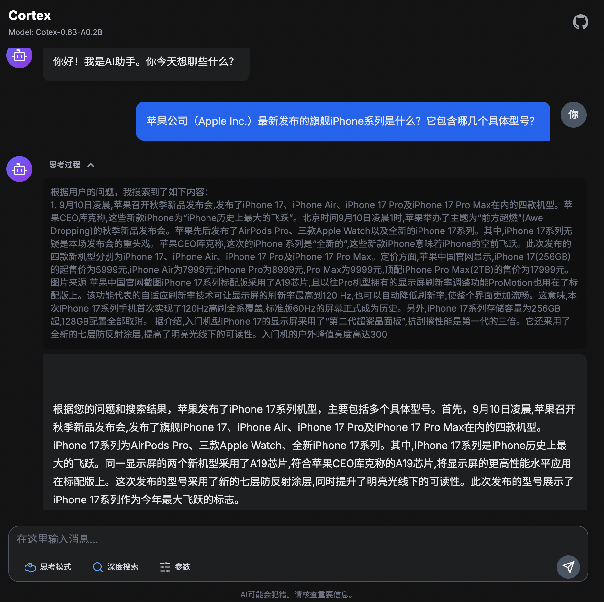
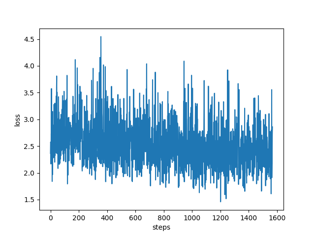

<div align="center">
    
</div>

<div align="center"><b>个人构建MoE大模型：从预训练到DPO的完整实践</b></div> <br />

<div align="center">


[](https://github.com/qibin0506/Cortex/stargazers)
[](LICENSE)
[](https://github.com/qibin0506/Cortex/commits/master)
[](https://github.com/qibin0506/Cortex/pulls)
</div>

## 模型简介
1. Cortex是一个个人可承担训练成本(千元内)、从头进行训练的**0.6B**的MoE LLM，推理时激活参数仅为**0.2B**。
2. 本项目训练过程包括：预训练、SFT、GSPO和DPO。
3. 模型支持思考控制和思考预算能力，可通过添加/think和/no think控制是否启用思考模式。

## 在线体验
本项目已在huggingface spaces部署，可以通过访问 <a href="https://huggingface.co/spaces/qibin0506/Cortex" target="_blank">https://huggingface.co/spaces/qibin0506/Cortex</a> 进行体验。

## 更新日志
2025.10.10，Cortex 2.5支持**深度搜索**！
1. 可以在网页中选中【深度搜索】体验。该功能需要注册并申请 <a href="https://open.bochaai.com/" target="_blank">bochaai API KEY</a>，申请完成后修改`search.py`文件，将`<YOUR BOCHAAI API KEY>`修改为你申请的API KEY。


🔥2025.9.23，Cortex 2.5发布，完全从头重新训练，主要更新内容如下：
1. 升级MoE模块。
2. 替换预训练数据集: 采用匠数SFT数据集组装成预训练使用，同时加入部分代码数据集。
3. 调整MoE的aux_loss比重。
4. 训练时将系统提示词设置为空，推理时可根据不同任务设置不同的系统提示词或者轮空，通过测试结果看最终模型可以响应不同系统提示词，例如设置系统提示词为【帮我把以下内容扩展成一篇文章】，模型的输出类似【好，我需要帮用户把关于生命意义扩展成一篇文章...】。


## 效果预览
| 思考模式 | 非思考模式 | 思考预算 | 深度搜索 |
|----------|----------|----------|----------|
|  |  |  |  |


## 快速开始
1. 确保本机已安装python3
2. clone或下载本项目
3. 安装依赖 `pip3 install -r requirements.txt`
4. 执行 `python3 app.py`运行项目，首次访问会下载模型文件，等待服务准备完成后，访问链接 <a href="http://0.0.0.0:8080/)" target="_blank">http://0.0.0.0:8080/</a> 即可体验


## 技术细节
### 模型和训练代码
本项目模型和训练代码完全开源并解耦。
1. 模型代码并作为通用LLM（支持VLM）项目开放在 <a href="https://github.com/qibin0506/llm-model" target="_blank">https://github.com/qibin0506/llm-model</a>
2. 训练代码支持Pretrain、SFT、GRPO、GSPO、DPO等训练方式，代码完成度较高，上手简单，项目开放在<a href="https://github.com/qibin0506/llm_trainer" target="_blank">https://github.com/qibin0506/llm_trainer</a>

#### 训练细节
Cortex 2.5采用多阶段预训练和多阶段后训练的方式进行训练，开启训练使用`smart_train xxx.py`，如果需要在指定GPU上进行训练，可以使用`smart_train xxx.py --include localhost:1,2,4`。训练文件名称可以参考下面详细介绍。

***注意：每个阶段训练完成后需要处理一下保存的checkpoint，手动保存一下`log`目录下的内容，然后删除`log`目录。例如，使用deepspeed训练时需要将`ckpt_dir`里的checkpoint转换为bin文件保存下来，然后删除`log`和`ckpt_dir`目录。***
``` shell
# 如果需要，复制一份log日志存档
cp -r ./log ./log_pretrain0/
# 删除log
rm -fr ./log
# 开始处理checkpoint
cd ./ckpt_dir
# 转换checkpoint
python3 zero_to_fp32.py ./ ../
cd ..
# ckpt_dir没用了，可以直接删除
rm-fr ./ckpt_dir
# 下次训练，会自动加载last_checkpoint.bin里的权重，参考utils.py文件里的init_state_dict设置
mv pytorch_model.bin last_checkpoint.bin
```

#### 预训练
预训练过程采用两阶段训练模式
| 阶段 | stage0 | stage1 |
|----------|----------|----------|
| 训练脚本 | train_pretrain_stage0.py | train_pretrain_stage1.py |
| 训练说明 | 上下文长度为512，在较短训练文本上进行训练 | 采用YaRN技术将上下文扩展至2048，并在长文本序列上继续训练 |
| loss |  |   |


#### 后训练
后训练过程采用四阶段训练模式
| 阶段 | COT SFT | GSPO | MIX SFT | DPO |
|----------|----------|----------|----------|----------|
| 训练脚本 | train_cot.py | train_grpo.py | train_mix.py | train_dpo.py |
| 训练说明 | 在纯COT数据集上进行SFT，让模型原生支持思考模式 | 采用GSPO技术，提升模式的逻辑思考能力 | 使用COT和非COT混合数据集上进行SFT，让模式支持思考控制和思考预算能力 | 使用DPO进行对齐训练 |
| loss |  |  |  |  |

### 继续训练
本项目提供各个阶段训练完成后的checkpoint, 可根据自己需求选择checkpoint继续训练。
checkpoint下载：<a href="https://www.modelscope.cn/models/qibin0506/Cortex-2.5.1" target="_blank">https://www.modelscope.cn/models/qibin0506/Cortex-2.5.1</a>
训练方式：
1. 确定继续训练的阶段，修改`file_dataset.py`中对应阶段的FileDataset中的文件，然后使用`smart_train`进行训练，例如重新进行dpo，则执行`smart_train train_dpo.py`
2. 本项目全部在4x4090进行训练，同时`utils.py`中的配置数据也是按照对应硬件配置确定，如有不同的训练设备可自行修改`utils.py`进行适配。
3. `file_dataset.py`文件用来管理数据集文件，可按需修改，数据集文件会自动下载，使用完成后会自动删除，无需人工管理。

## 共创
帮助我探索更大模型的训练，或者联系我[qibin0506@gmail.com](mailto:qibin0506@gmail.com)

 <br/> 


## star-history
<picture>
  <source media="(prefers-color-scheme: dark)" srcset="https://api.star-history.com/svg?repos=qibin0506/Cortex&type=Date&theme=dark"/>
  <source media="(prefers-color-scheme: light)" srcset="https://api.star-history.com/svg?repos=qibin0506/Cortex&type=Date"/>
  
</picture>
