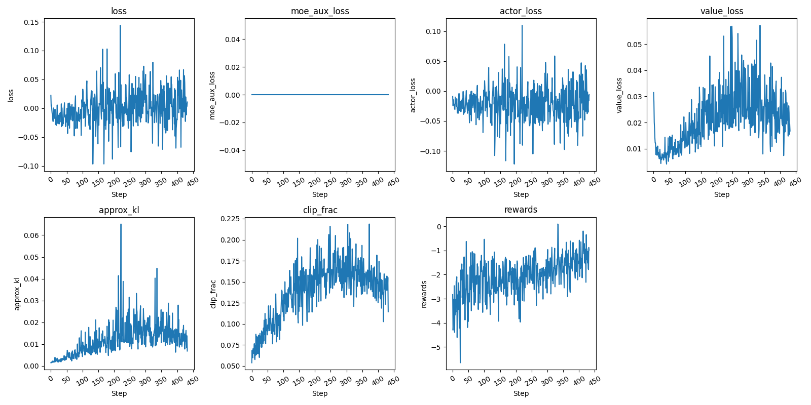

## 快速验证PPO

### 目的
本项目通过训练一个0.1B的Dense模型，快速验证了<a href="https://github.com/qibin0506/llm_trainer" target="_blank">https://github.com/qibin0506/llm_trainer</a>中实现的PPO算法。
训练成本在百元内，可以单独复现。

### PPO关键指标

### 训练流程
先进行预训练(`smart_train train_pretrain.py`)，在进行SFT(`smart_train train_sft.py`)，最后进行PPO(`smart_train train_ppo.py`)